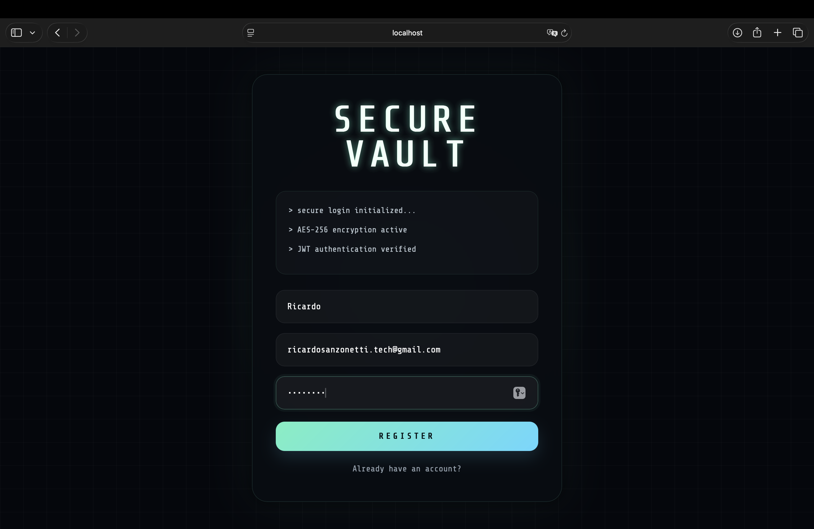
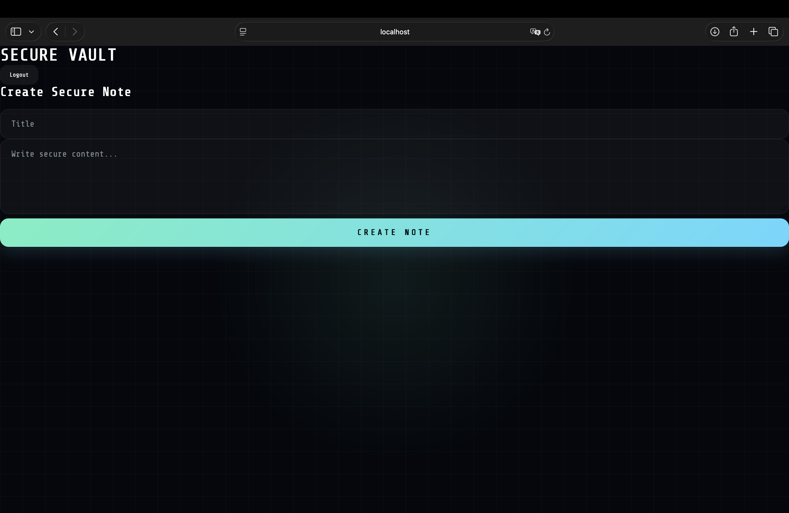
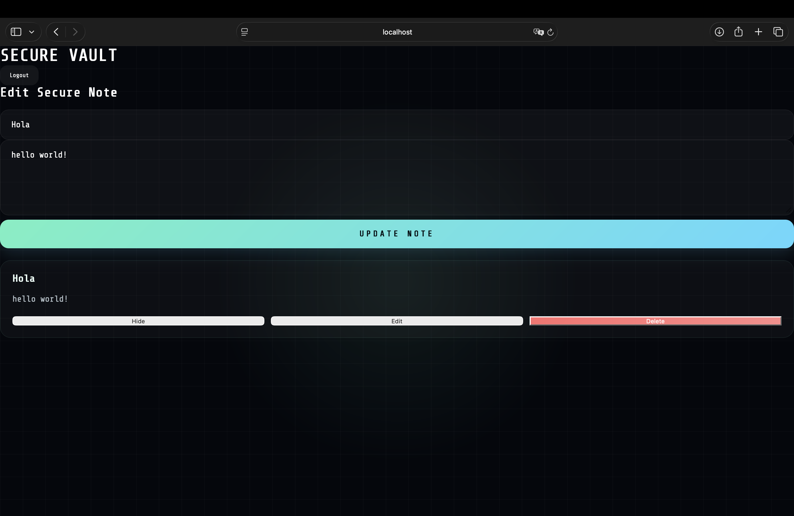
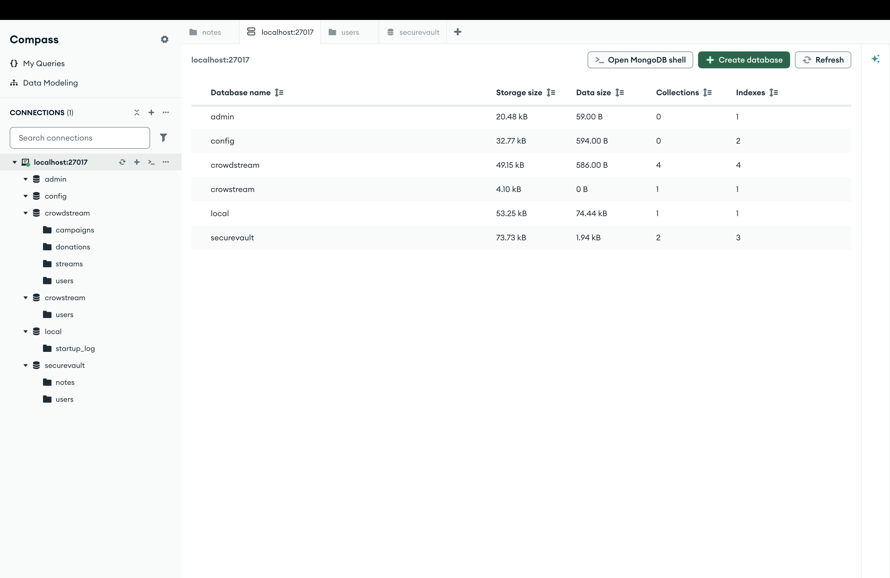
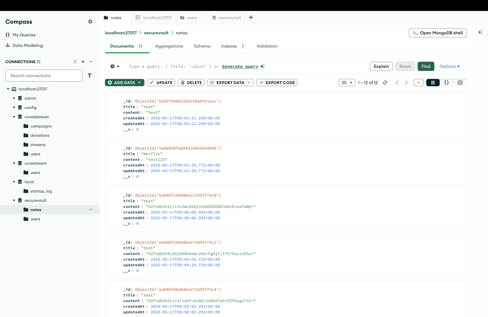
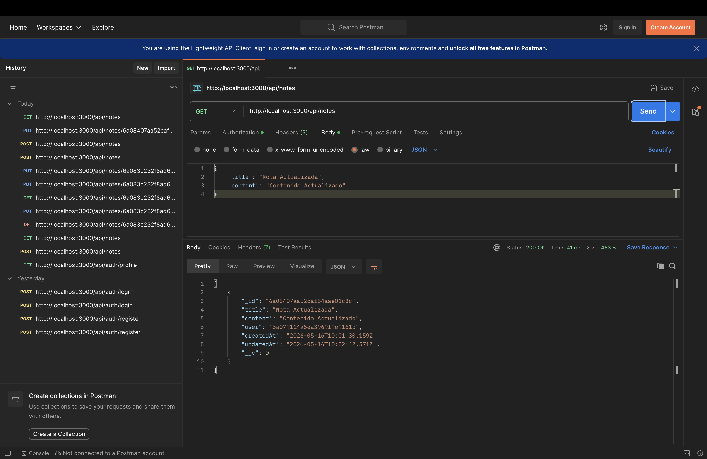
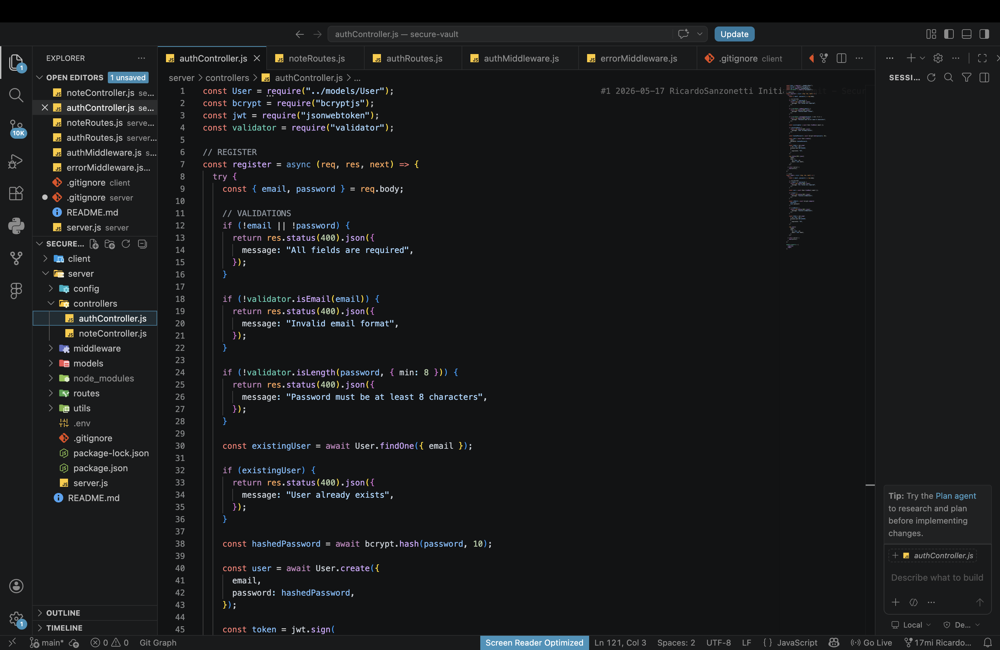

# Secure Vault

Secure Vault is a MERN stack application focused on secure note management with JWT authentication and encrypted data handling.

---

# Features

- User registration and login
- JWT authentication
- Protected routes
- Create secure notes
- Edit secure notes
- Delete secure notes
- MongoDB integration
- AES encrypted notes
- Responsive cyberpunk-inspired UI

---

# Tech Stack

## Frontend

- React
- Vite
- CSS

## Backend

- Node.js
- Express.js
- MongoDB
- Mongoose
- JWT
- bcryptjs
- crypto-js

---

# Screenshots

## Register Page



---

## Create Secure Note



---

## Edit Secure Note



---

## MongoDB Database



---

## Encrypted Notes in MongoDB



---

## API Testing with Postman



---

## Backend Authentication Controller



---

# Installation

## Clone repository

```bash
git clone https://github.com/ricardosanzonetti/Secure-Vault.git
## Install frontend dependencies

```bash
cd client
npm install
npm run dev
```

## Install backend dependencies

```bash
cd server
npm install
npm run dev
```

## Environment Variables

Create a `.env` file inside `/server`

```env
MONGO_URI=your_mongodb_uri
JWT_SECRET=your_secret
AES_SECRET=your_secret
```

## Security

- Password hashing using bcryptjs
- JWT authentication
- AES encryption for notes
- Protected API routes

## Future Improvements

- Search notes
- Categories and tags
- Docker support
- Cloud deployment
- Better mobile responsiveness
